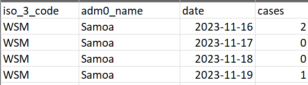

# whoforecast

Authors: Martina McMenamin

## Preamble

This is an experimental package to run nowcasting and forecasting analysis and create a report output. ***Please note that the user of this package is responsible for the outputs and these are not WHO endorsed.*** 

***THIS APP IS CURRENTLY IN EARLY DEVELOPMENT - PLEASE LOG A GITHUB ISSUE OR CONTACT THE AUTHORS FOR ANY ISSUES***

## Installation

To install this package for the first time: 

```
devtools::install_github("whocov/whoforecast", 
                          force = TRUE, 
                          dependencies = TRUE)
```

## Prepare data

To use this package, you will need to have a dataset with the following columns:

- `date`: the date of the data point
- `cases`: the number of cases on that date
- `iso_3_code`: the ISO 3 code of the country
- `adm0_name`: the name of the country or `adm1_name` if regional level analysis

<p align="center">

</p>


## Run analysis

To run the analysis, you will need to follow the steps below:

```
library(whoforecast)

# Load the data 
test_data <- read_csv("/your_path/example_data.csv") 

# Run the analysis - edit the function arguments as needed
run_forecast(
    data = test_data, # read in your data
    adm_level = "adm0", # set to "adm0" if national level and "adm1" if regional level analysis
    rep_freq = "weekly", # set to "weekly" or "daily" based on the reporting frequency in the data
    nowcast = TRUE, # set to TRUE if you want to run nowcasting analysis
    generation_time = get_gen_time(), # set to the generation time for the disease - uses default but can be specified
    incubation_period = get_inc_period(), # set to the incubation period for the disease - uses default but can be specified
    reporting_delay = get_rep_delay(), # set to the reporting delay for the disease - uses default but can be specified
    forecast = TRUE, # set to TRUE if you want to include forecasting analysis
    horizon = 7, # set to the number of days you want to forecast
    create_report = TRUE, # set to TRUE if you want to create a report in Word
    date_from = min(data$date), # set to the start date for the estimation
    date_var = "date", # set to the name of the date column in the data
    case_var = "cases" # set to the name of the cases column in the data
    )
```


## Analysis output

The analysis will output a list with the following elements of interest:

* Figure of estimates for effective reproduction number (Rt) over time
* Figure of estimates for the number of reported cases over time
* Word document with the analysis output and interpretation

